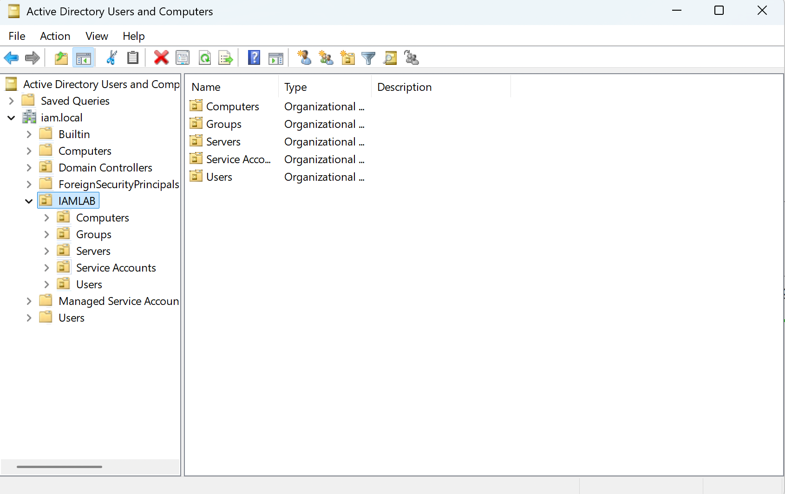

# Active Directory IAM Lifecycle Automation Lab

Hands-on Identity and Access Management lab demonstrating automated **Joiner, Mover, and Leaver (JML)** lifecycle operations using Windows Server Active Directory and PowerShell.

> **Status:** On-premises Active Directory JML automation completed. Hybrid identity / Microsoft Entra ID integration is planned as a later phase.

## Project Overview

This lab simulates identity lifecycle administration in an Active Directory environment. The project focuses on repeatable identity operations, department-based access assignment, least-privilege access changes, deprovisioning, defensive controls, and audit logging.

### IAM capabilities demonstrated

- Automated user provisioning
- Identity attribute management
- Department-based security-group assignment
- Joiner / Mover / Leaver lifecycle workflows
- Removal of obsolete access during role changes
- Account disablement and access removal during offboarding
- Duplicate-account protection
- Repeated-offboarding protection
- SUCCESS / FAILED / BLOCKED audit events
- PowerShell error handling and validation

## Lab Environment

| Component | Implementation |
| --- | --- |
| Hypervisor | VMware Fusion |
| Domain | `iam.local` |
| Domain Controller | `DC01` |
| DC IPv4 | `172.16.147.10` |
| Directory | Active Directory Domain Services |
| DNS | Windows Server DNS |
| Automation | PowerShell |
| Lab OU | `IAMLAB` |

## Architecture


*Architecture diagram will be added after the final lab diagram is created.*

The Active Directory structure separates users, groups, computers, servers, and service accounts beneath the `IAMLAB` organizational unit.

## Active Directory Design

Departmental security groups currently used in the lab include:

- `GG-HR`
- `GG-Finance`
- `GG-IT`
- `GG-Sales`

These groups model department-based access entitlements and allow lifecycle automation to grant or remove access as an identity changes roles.

### OU Structure



*Screenshot placeholder — final evidence image will be added.*

## Joiner Workflow

The Joiner workflow creates an Active Directory identity, populates employee attributes, assigns the appropriate department security group, verifies the result, and records the operation.

```text
New Employee
     |
     v
Check for Existing Identity
     |
     +-- Exists --> BLOCK
     |
     v
Create AD User
     |
     v
Set Department / Title / Company
     |
     v
Assign Department Group
     |
     v
Verify Identity + Membership
     |
     v
Write Audit Event
```


The workflow also checks for an existing `sAMAccountName` before provisioning. Duplicate identities are blocked rather than modified.


## Mover Workflow

The Mover workflow updates an employee's business attributes and recalculates departmental access.

```text
Current Identity
     |
     v
Capture Existing Access
     |
     v
Update Department / Title
     |
     v
Remove Previous Department Access
     |
     v
Assign New Department Access
     |
     v
Verify + Audit
```

A tested lifecycle scenario transferred a lab identity from Sales to Human Resources. The previous `GG-Sales` entitlement was removed and `GG-HR` was assigned.


### Troubleshooting and Control Improvement

During initial testing, the Mover workflow attempted to derive the group `GG-Human Resources` directly from the department name. The existing entitlement was named `GG-HR`, causing the operation to fail.

The workflow was corrected by introducing an explicit department-to-group mapping:

```powershell
$DepartmentGroups = @{
    "Human Resources" = "GG-HR"
    "Finance"         = "GG-Finance"
    "IT"              = "GG-IT"
    "Sales"           = "GG-Sales"
}
```

The failed event was retained in the audit log. A subsequent test completed successfully.

## Leaver Workflow

The Leaver workflow disables a departing identity and removes non-default group access.

```text
Departing Employee
     |
     v
Verify Identity
     |
     v
Check Account State
     |
     +-- Already Disabled --> BLOCK
     |
     v
Disable Account
     |
     v
Remove Non-Default Groups
     |
     v
Record Offboarding Status
     |
     v
Verify + Audit
```


A second attempt to offboard an already-disabled account is detected and blocked, preventing unnecessary repeated changes.

## Audit Logging

Lifecycle operations are written to `C:\IAMLAB\Logs\Provisioning.log`. Audit records include a timestamp, execution status, affected username, and operation result.

The lab has produced **SUCCESS**, **FAILED**, and **BLOCKED** events, allowing both successful operations and control failures to be reviewed.


## IAM Controls Demonstrated

| Control | Lab Implementation |
| --- | --- |
| Joiner | Automated AD account creation and attribute assignment |
| Mover | Department/title changes and entitlement reassignment |
| Leaver | Account disablement and non-default access removal |
| Least Privilege | Previous departmental access removed during transfers |
| Group-Based Access | Departmental AD security groups |
| Duplicate Protection | Existing usernames detected before provisioning |
| Offboarding Safeguard | Already-disabled identities are blocked |
| Auditability | Timestamped SUCCESS / FAILED / BLOCKED records |
| Error Handling | Failed operations are surfaced and logged |
| Verification | Identity attributes and group membership checked after changes |

## Automation Scripts

The final tested versions of the PowerShell scripts will be published in the `scripts/` directory after they are exported from the lab server.

| Script | Purpose |
| --- | --- |
| `Joiner-Provisioning-v2.ps1` | Provision identities and assign initial department access |
| `Mover-Transfer.ps1` | Update role attributes and recalculate department access |
| `Leaver-Offboarding.ps1` | Disable identities and remove non-default access |

## Evidence

Final screenshots will be stored in `screenshots/` and will show the AD structure, departmental groups, successful lifecycle operations, defensive controls, and audit trail.

## Next Phase

The next phase will extend the lab toward hybrid identity, including a Windows client, Microsoft Entra ID synchronization, and additional cloud identity controls. These components are not presented as completed until they have been built and tested.

## Disclaimer

This is a personal cybersecurity/IAM lab using fictional test identities and an isolated lab environment. It is intended for hands-on learning and portfolio demonstration.
