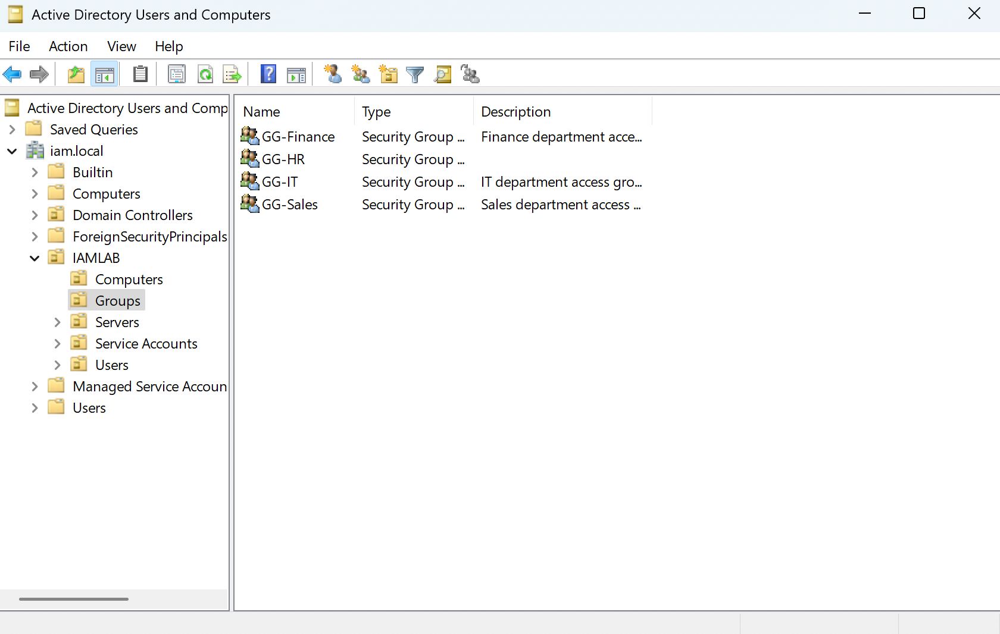
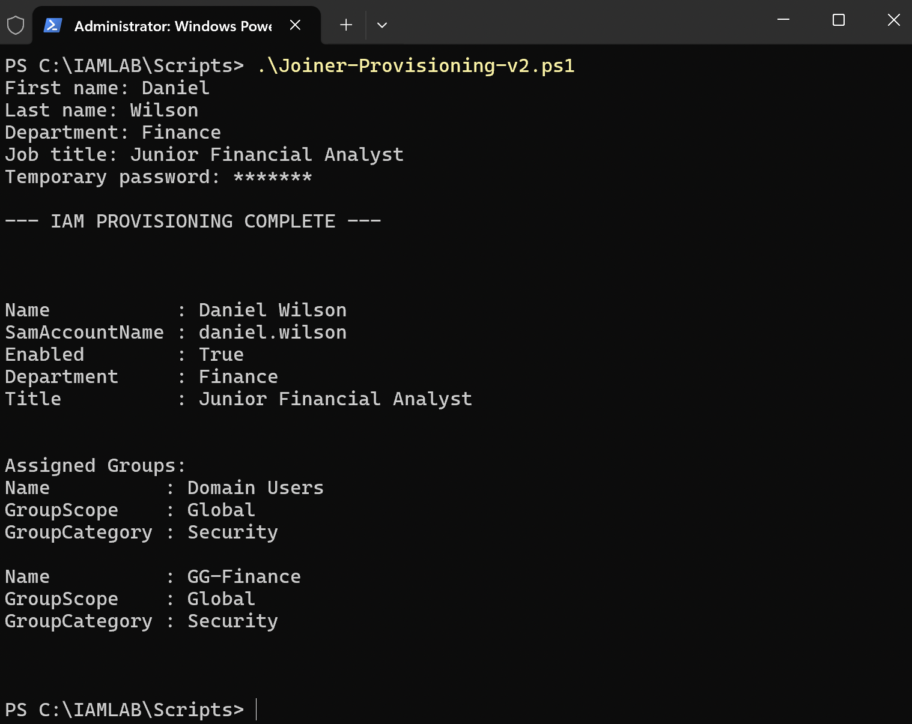
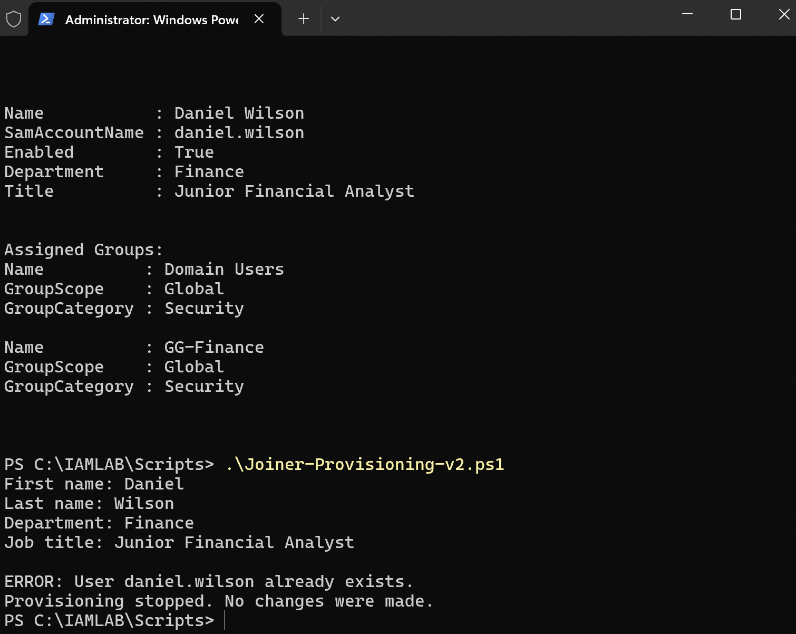
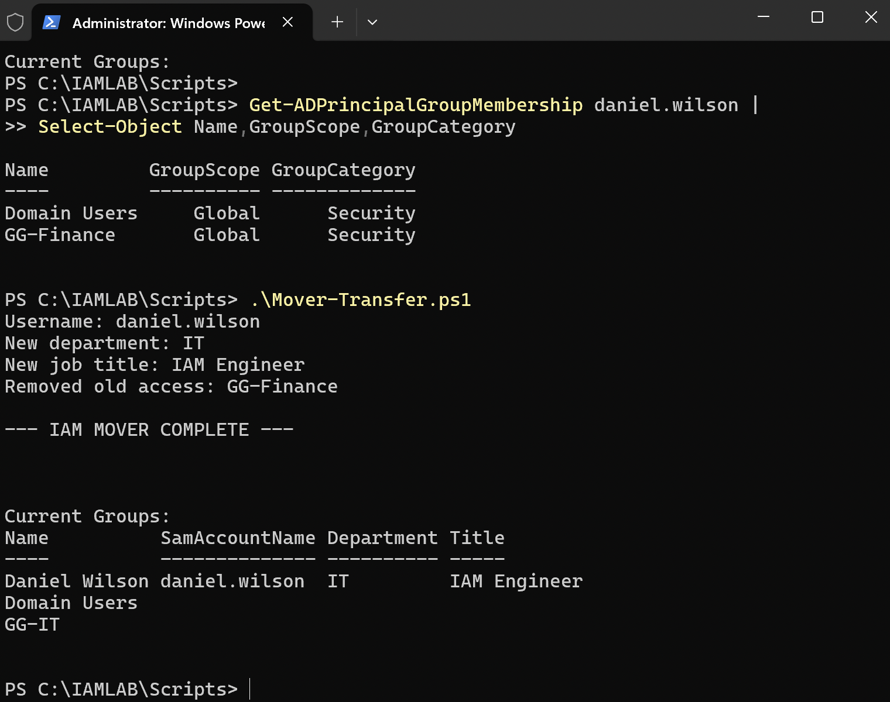
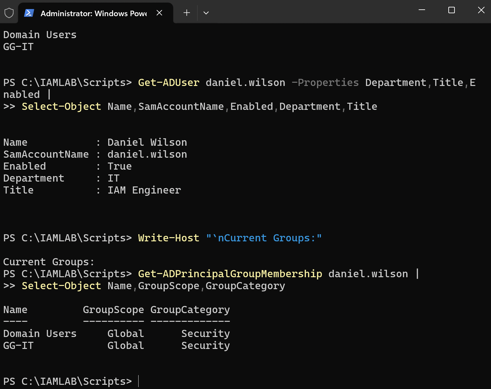
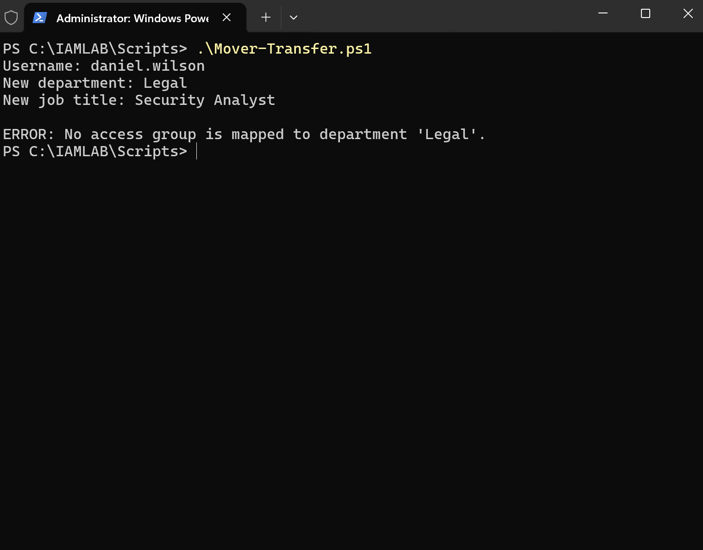
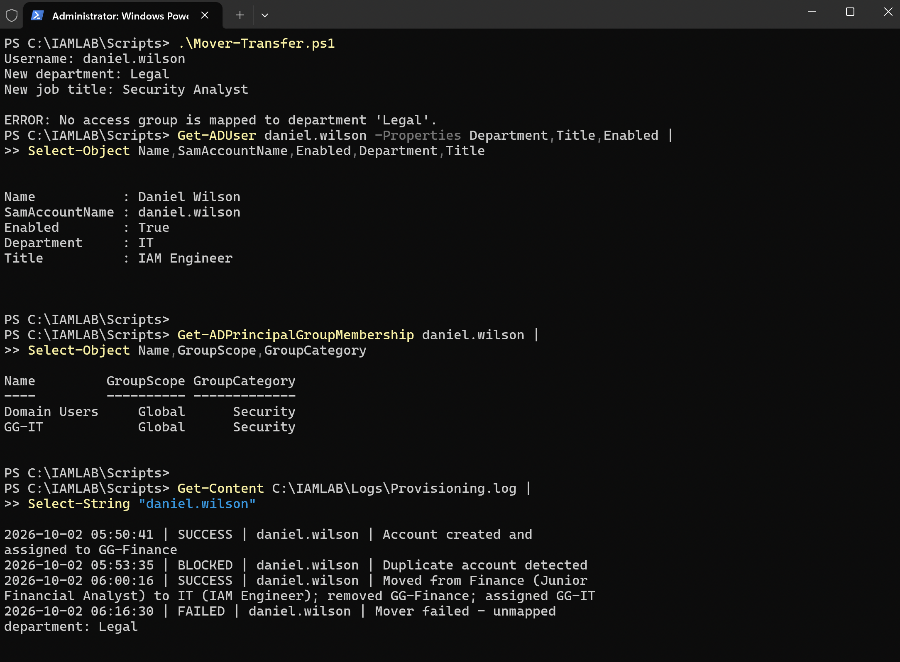
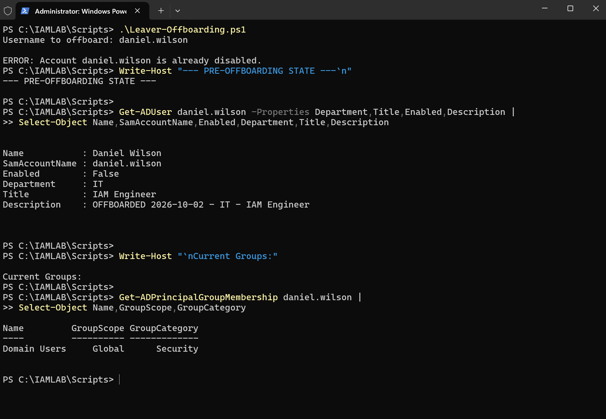
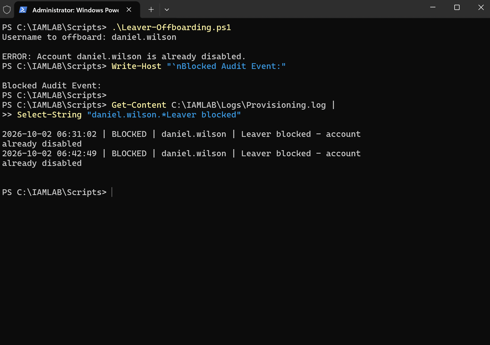
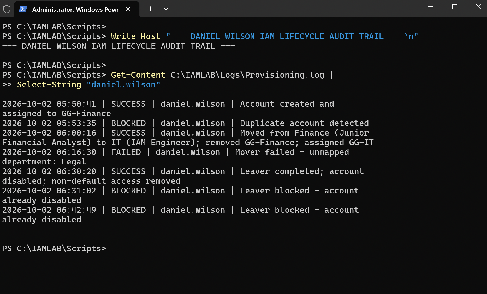

# Active Directory IAM Lifecycle Automation Lab

Hands-on Identity and Access Management (IAM) portfolio project demonstrating Joiner-Mover-Leaver (JML) lifecycle automation in Microsoft Active Directory with PowerShell.

## Objective
Build and test a repeatable workflow that provisions identities, changes access when responsibilities change, removes access during offboarding, and records auditable lifecycle events.

## Lab Environment
- Active Directory Domain Services (AD DS), domain `iam.local`
- PowerShell ActiveDirectory module
- `IAMLAB` OUs: Users, Groups, Computers, Servers, Service Accounts
- Global Security Groups: `GG-HR`, `GG-Finance`, `GG-IT`, `GG-Sales`
- Audit log: `C:\IAMLAB\Logs\Provisioning.log`

## Demonstrated Controls
| Stage | Validated behavior |
|---|---|
| Joiner | Creates enabled AD user, sets identity attributes, assigns department access, logs event |
| Duplicate protection | Blocks an existing `SamAccountName` without changing the account |
| Mover | Validates destination, removes previous access, updates department/title, assigns new access |
| Invalid mover | Rejects an unmapped department before identity/access changes |
| Leaver | Disables account, removes non-default groups, records offboarding state |
| Repeat leaver | Blocks offboarding when the account is already disabled |

## End-to-End Test
The primary test identity was `daniel.wilson`.

1. Created in Finance as Junior Financial Analyst and assigned `GG-Finance`.
2. Duplicate provisioning request was blocked.
3. Moved Finance → IT; title changed to IAM Engineer; `GG-Finance` removed; `GG-IT` assigned.
4. Transfer to unmapped `Legal` was rejected. Verification confirmed the identity remained IT / IAM Engineer / `GG-IT`.
5. Offboarding disabled the account and removed non-default access.
6. Repeated offboarding was blocked because the account was already disabled.

## Repository
```text
.
├── README.md
├── scripts/
│   ├── Joiner-Provisioning-v2.ps1
│   ├── Mover-Transfer.ps1
│   └── Leaver-Offboarding.ps1
├── docs/
│   ├── lab-setup.md
│   ├── joiner.md
│   ├── mover.md
│   ├── leaver.md
│   └── troubleshooting.md
└── screenshots/
    └── validated JML evidence
```

## Visual Case Study

### 1. Active Directory IAM Structure

The lab separates users, groups, computers, servers, and service accounts beneath a dedicated `IAMLAB` OU. Department access is represented with Global Security Groups.




### 2. Joiner — Provision Identity and Access

The Joiner workflow created `daniel.wilson` in Finance as a Junior Financial Analyst and assigned `GG-Finance`.



A second provisioning request for the same `SamAccountName` was blocked, preventing a duplicate identity.



### 3. Mover — Change Role and Remove Previous Access

Before the transfer, Daniel was in Finance with `GG-Finance`. The Mover workflow changed the department to IT, changed the title to IAM Engineer, removed `GG-Finance`, and assigned `GG-IT`.



Independent verification confirmed the resulting IT attributes and `GG-IT` membership.



### 4. Defensive Mover Validation

A transfer request to the unmapped department `Legal` was rejected.



Post-failure verification confirmed the account remained IT / IAM Engineer with `GG-IT`, demonstrating that the validation failure did not alter the existing identity/access state.



### 5. Leaver — Disable Identity and Remove Access

The Leaver workflow disabled the account and removed non-default group access. Verification showed the account disabled with only the default `Domain Users` membership remaining.



A repeated offboarding request was blocked because the identity was already disabled.



### 6. Lifecycle Audit Trail

The consolidated audit trail records the tested lifecycle as `SUCCESS`, `BLOCKED`, and `FAILED` events: initial provisioning, duplicate protection, successful transfer, rejected invalid transfer, successful offboarding, and repeat-offboarding protection.



For the full 15-image evidence sequence, see [screenshots/README.md](screenshots/README.md).

## IAM Concepts Practiced
Identity lifecycle management, department-based access assignment, least privilege, provisioning/deprovisioning, account disablement, entitlement removal, input validation, duplicate-account prevention, defensive error handling, audit logging, and post-change verification.

## Scope
This is a lab project, not production administration or employer work. This phase covers on-premises Active Directory lifecycle automation. Cloud identity integration can be added as a later extension.
