# RBAC and Identity Lifecycle Access-Control Validation

This case study extends the Active Directory Joiner, Mover, and Leaver automation lab beyond identity administration by validating how identity state and security-group membership affect access to protected resources.

The scenario uses the domain-joined Windows 11 workstation `WIN11-01`, Active Directory domain `iam.local`, department security groups, and protected SMB resources hosted on `DC01`.

## Control Objectives

The validation demonstrates:

- domain authentication from a managed workstation;
- role-based access through Active Directory security groups;
- least-privilege authorization to department resources;
- denial of access for users without the required entitlement;
- removal of obsolete access during a Mover event;
- assignment of new access after a department transfer;
- account disablement and entitlement removal during a Leaver event;
- prevention of authentication after offboarding; and
- audit evidence for lifecycle changes.

## 1. Domain-Joined Workstation

`WIN11-01` was joined to `iam.local`. The computer object initially appeared in the default Active Directory Computers container.

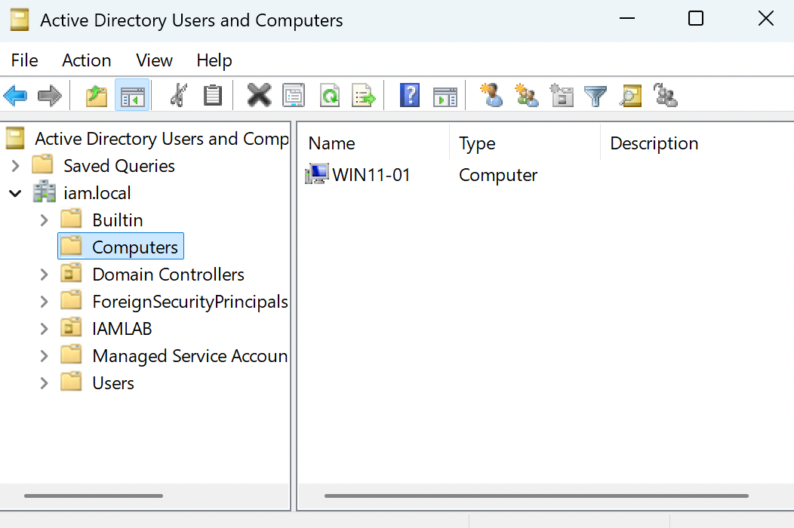

The workstation object was then moved into the lab's managed computer OU under `IAMLAB`.

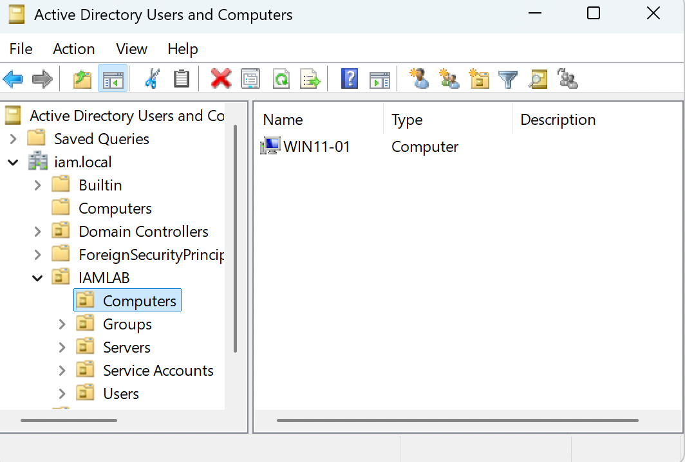

## 2. Domain User Authentication

John Smith authenticated to the domain-joined workstation as `iamlab\john.smith`. System information confirmed that the workstation was a member of `iam.local`.

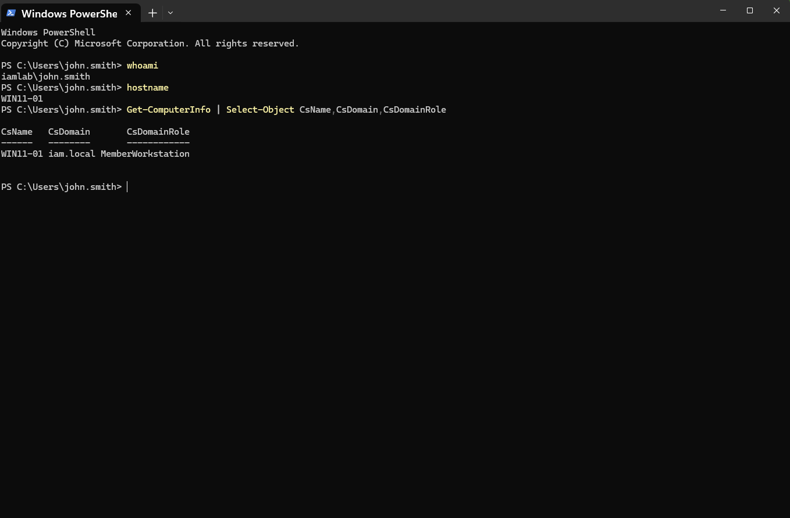

This establishes the endpoint and identity context used for the authorization tests below.

## 3. HR Resource — Authorized Access

A protected HR resource was created on `DC01` and exposed as an SMB share. Authorization was assigned to the `GG-HR` security group.

While John was an HR Specialist and a member of `GG-HR`, his logon token contained the HR group and he successfully listed and read the protected HR document.

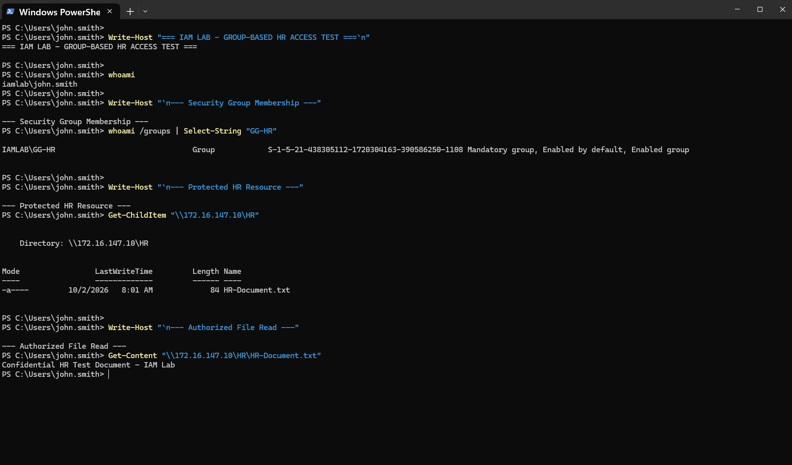

**Control demonstrated:** access is granted through group membership rather than direct user assignment.

## 4. HR Resource — Unauthorized User Denied

Sarah Johnson was assigned to Finance through `GG-Finance` and did not have `GG-HR` membership. Testing the same HR resource returned an access-denied result.

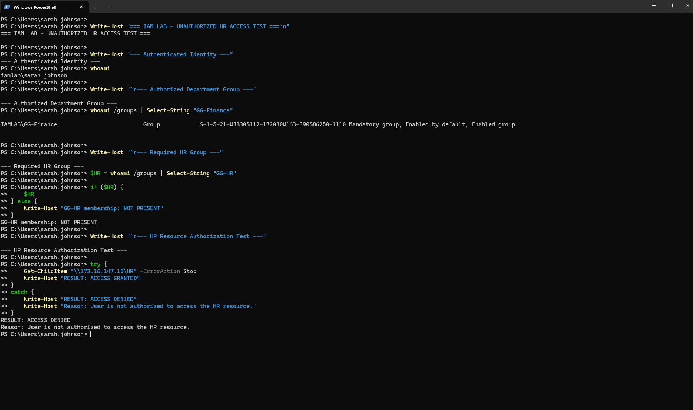

**Control demonstrated:** a valid domain identity does not automatically receive access to resources outside its assigned role.

## 5. Mover — HR to IT

Before the transfer, John was enabled as an HR Specialist with `GG-HR` access.

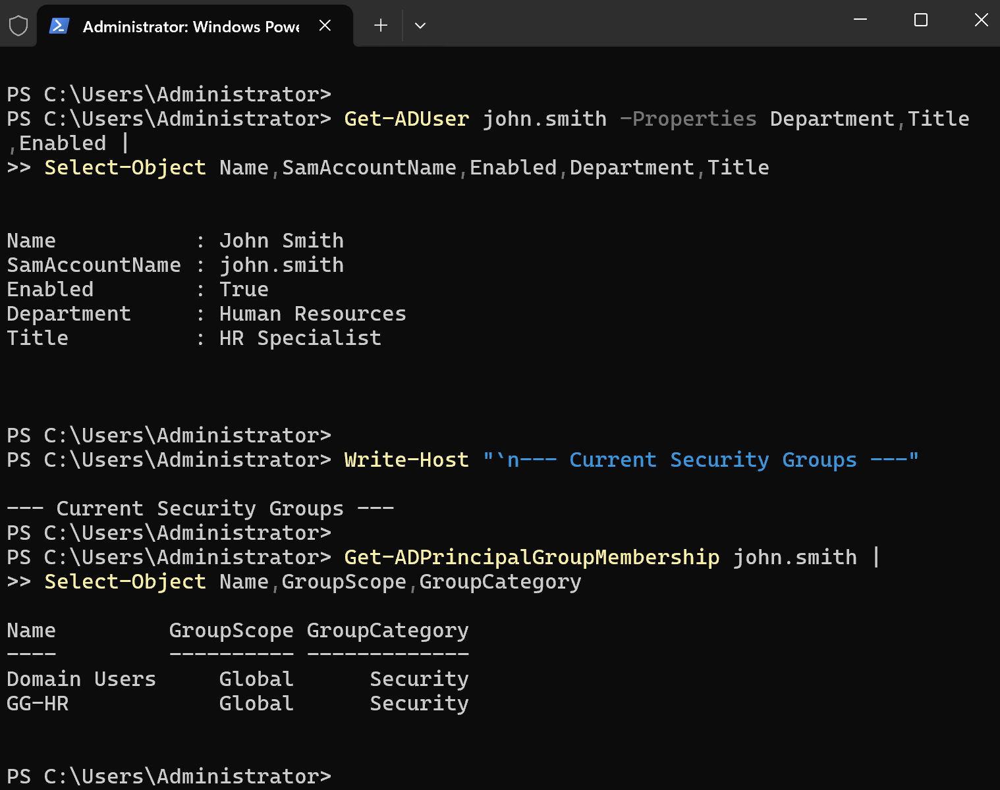

The Mover automation changed John's department from Human Resources to IT, changed his title to IT Support Specialist, removed `GG-HR`, and assigned `GG-IT`.

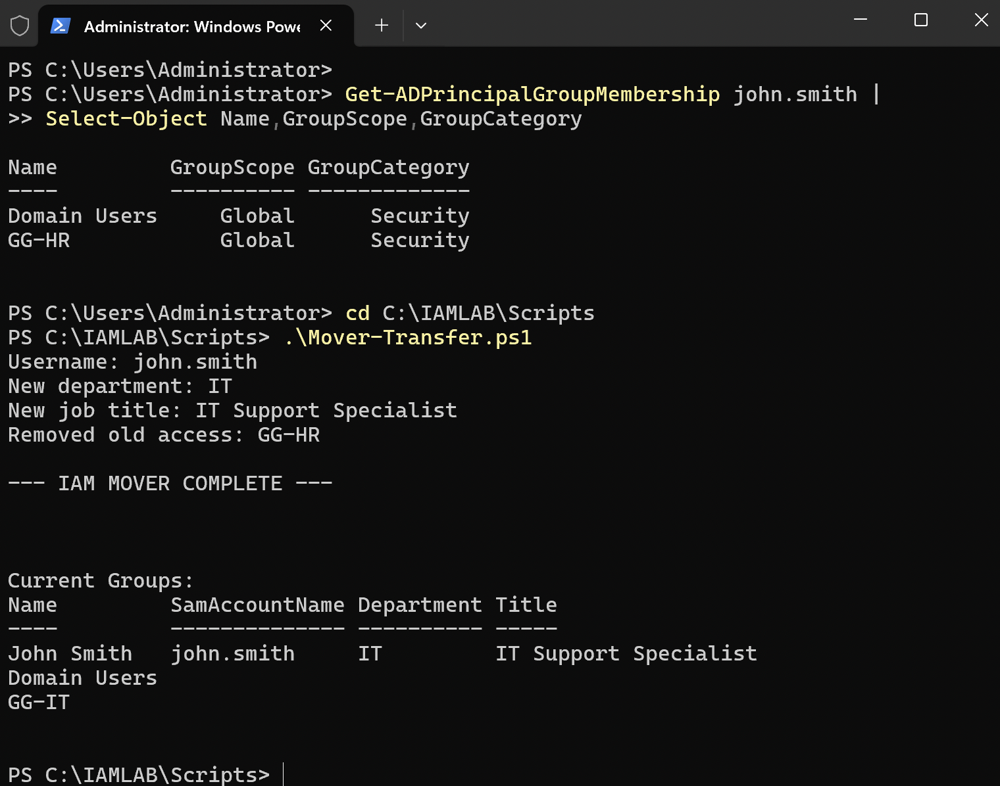

After the updated identity state was reflected in a refreshed logon session, John no longer had HR authorization. Access to the protected HR resource was denied.

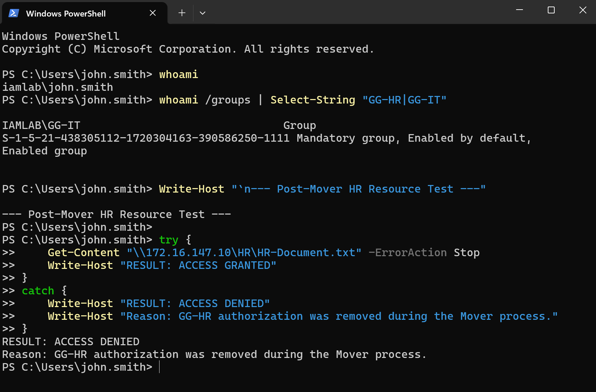

**Control demonstrated:** obsolete departmental access is removed during a role change instead of accumulating across the identity lifecycle.

## 6. IT Resource — New Role Access

A separate protected IT resource was configured with SMB and NTFS authorization for `GG-IT`. The evidence shows the IT security group receiving the intended permissions.

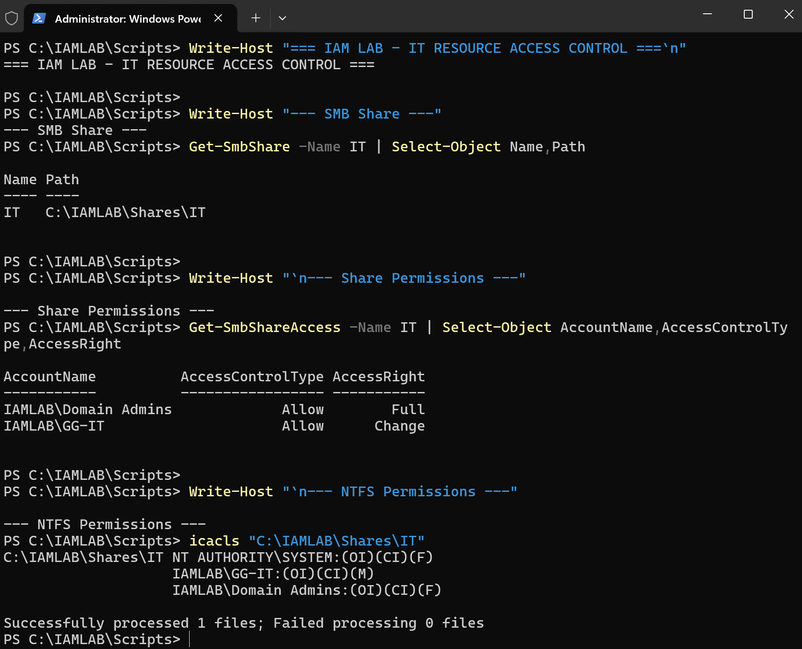

After the Mover event and session refresh, John's token contained `GG-IT`, and he successfully listed and read the protected IT document.

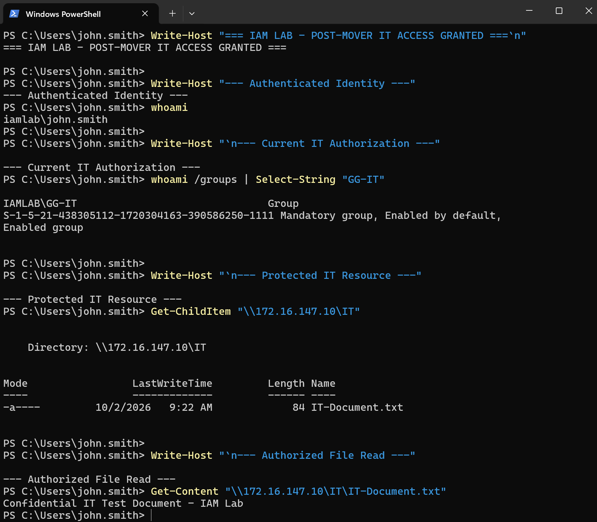

**Control demonstrated:** the Mover process removes access associated with the previous role and provisions access associated with the new role.

## 7. Leaver — Deprovisioning

Immediately before offboarding, John remained an enabled IT identity with `GG-IT` membership.

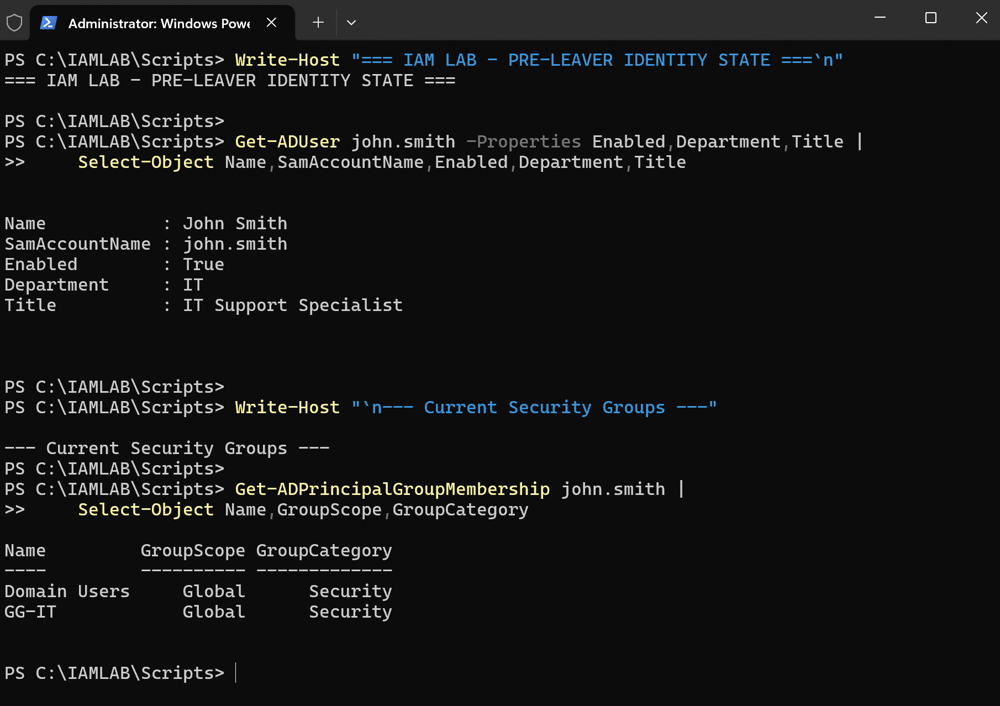

The Leaver automation disabled the account and removed `GG-IT`, leaving only the default `Domain Users` membership. The identity description was also updated with the offboarding state.

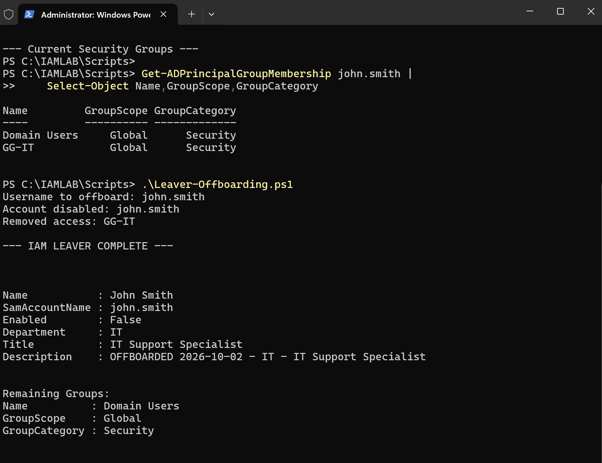

After John was completely signed out, a new Windows logon attempt was rejected because the domain account had been disabled.

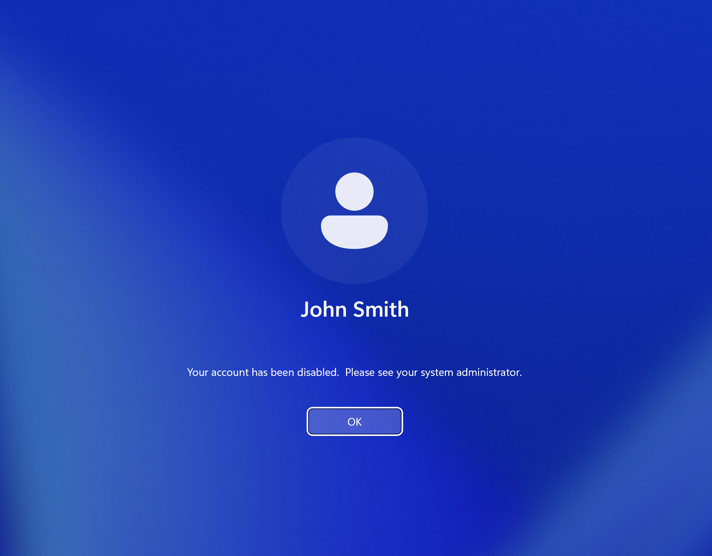

**Control demonstrated:** offboarding affects both authorization and authentication by removing non-default access and disabling the identity.

## 8. Lifecycle Audit Trail

The PowerShell lifecycle workflows write events to `C:\IAMLAB\Logs\Provisioning.log`. The final evidence records John's successful Mover and Leaver operations.

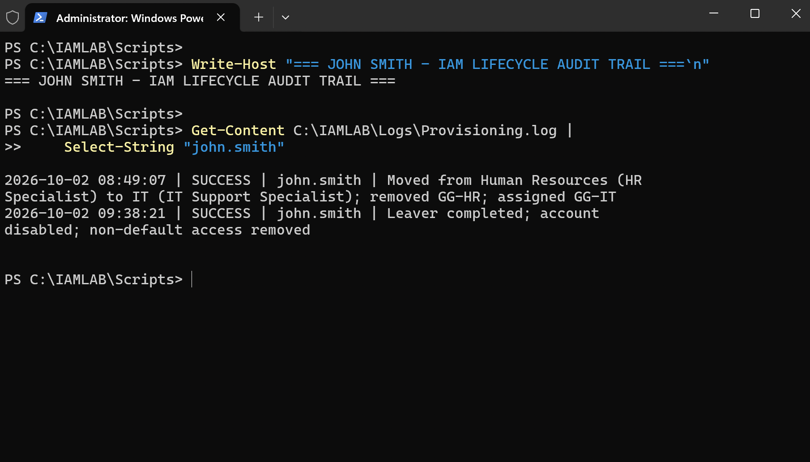

The audit trail provides timestamped evidence that the identity's access changes were executed through the lifecycle workflows.

## Security Takeaways

This scenario validates several core IAM principles in a functioning Active Directory environment:

| IAM Principle | Lab Validation |
| --- | --- |
| Authentication | Domain user authenticates from a domain-joined workstation |
| Authorization | Protected SMB resources use AD security-group membership |
| RBAC | HR and IT access are represented by `GG-HR` and `GG-IT` |
| Least Privilege | Finance identity is denied HR access |
| Mover Governance | Previous HR access is removed before/while IT access is assigned |
| Deprovisioning | Leaver workflow disables the account and removes non-default access |
| Access Revocation | Former HR entitlement is no longer available after the Mover |
| Authentication Revocation | Disabled Leaver account cannot start a new domain logon |
| Auditability | Lifecycle operations are recorded in the provisioning log |

## Session Token Observation

During testing, an existing Windows session temporarily retained group information from its earlier logon token after server-side group membership changed. A refreshed sign-in was required for the client session to reflect the new group state.

This distinction is important in IAM operations: changing directory membership and refreshing an already-issued authentication/authorization context are related but separate events.

---

This lab uses fictional identities and an isolated environment for hands-on IAM learning and portfolio demonstration.
